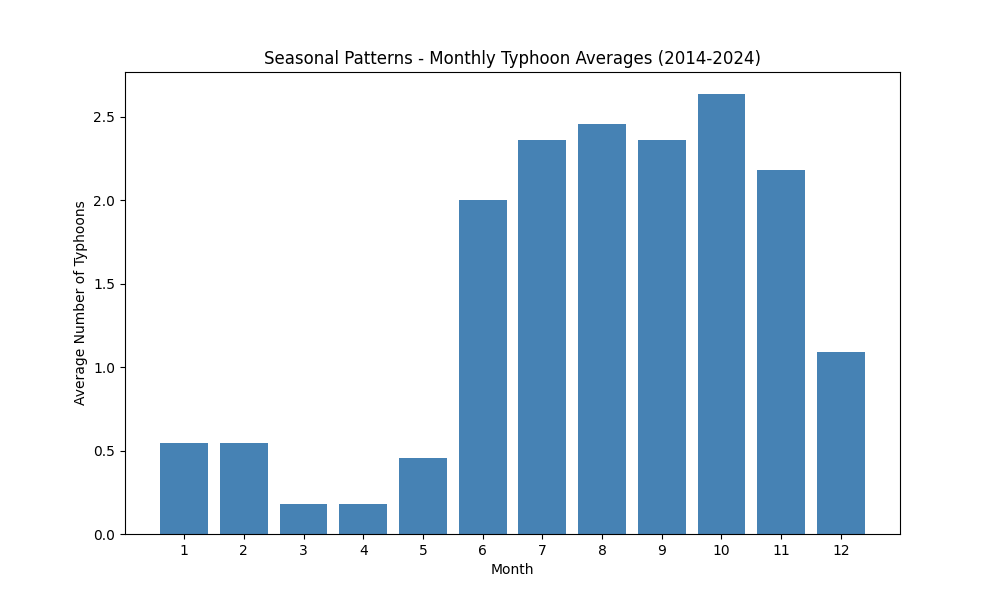
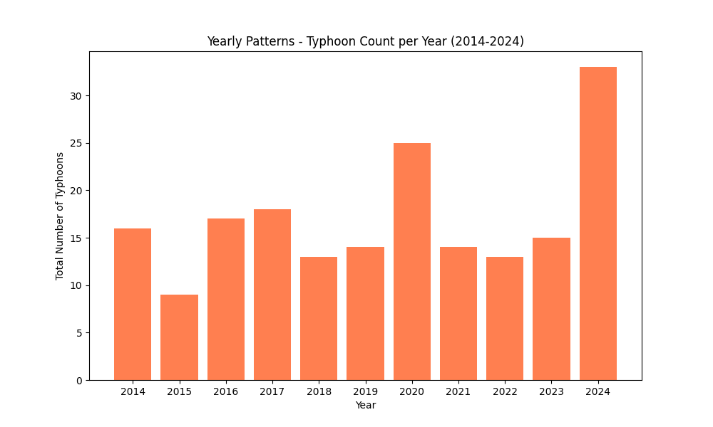
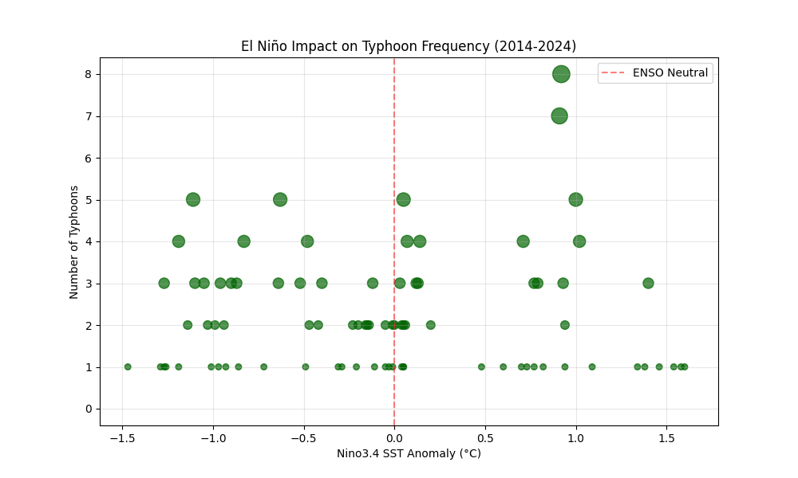
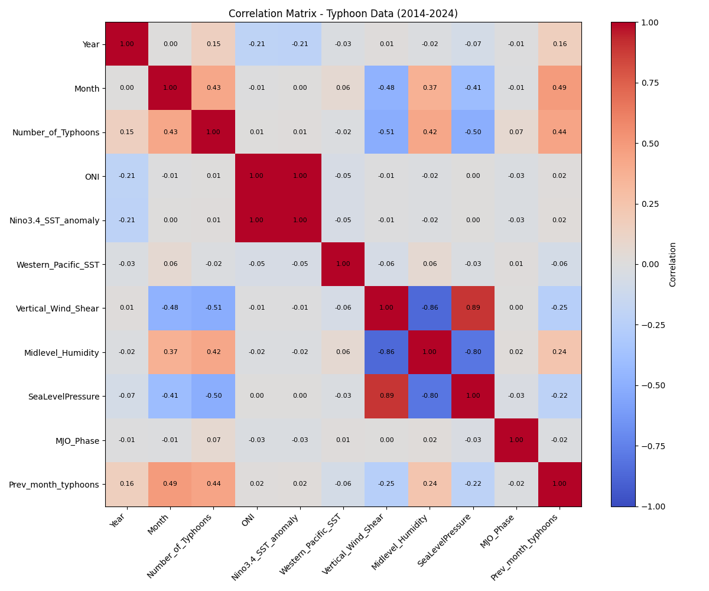

# Habasuri 

Habasuri is a project (for practice) that will help you analyze data using visual graphics such as bar graph, line graph, and many more. This project provide you pre-made graphs or you can create your own graph [Data](../Habasuri/helper/philippines_typhoon_monthly_2014_2024.csv).

### Premade Graphs

| # | Graph | Description | Preview |
|---|-------|-------------|---------|
| 1 | Seasonal Patterns | Bar chart showing average number of typhoons per month across all years (2014-2024) |  |
| 2 | Yearly Patterns | Bar chart displaying total typhoon count per year |  |
| 3 | El Niño Impact | Scatter plot showing relationship between Nino3.4 SST Anomaly and typhoon frequency |  |
| 4 | Correlation Matrix | Heatmap of correlations between all numeric columns in the dataset |  |

### Data Attribute
[Kaggle](https://www.kaggle.com/datasets/denvermagtibay/philippines-monthly-typhoon-trend-2014-2024/data)  
[License](https://creativecommons.org/licenses/by/4.0/)

